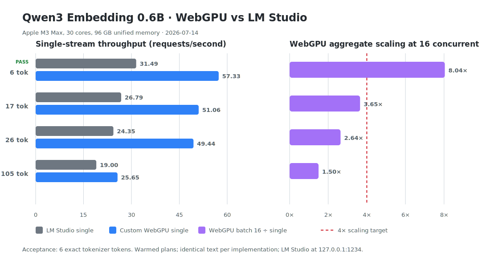

# Qwen3 Embedding 0.6B for WebGPU

A high-throughput Q4 WebGPU runtime for Qwen3 Embedding 0.6B. It uses a GPU-native prepacked model format, custom WGSL kernels, and native micro-batching for up to 16 simultaneous embedding requests.



## Performance

The benchmark uses identical text for both runtimes and exact tokenizer lengths including EOS. WebGPU results are medians from three warmed trials; LM Studio results use ten warmups and a 10-second measurement per condition. Model loading is excluded.

| Input | LM Studio single | WebGPU single | LM Studio 16× aggregate | WebGPU 16× aggregate |
|---:|---:|---:|---:|---:|
| 15 tokens | 28.84 req/s | **66.78 req/s** | 30.71 req/s | **249.60 req/s** |
| 50 tokens | 25.66 req/s | **41.72 req/s** | 27.25 req/s | **103.78 req/s** |
| 150 tokens | 18.53 req/s | **21.63 req/s** | 19.41 req/s | **36.58 req/s** |

At 16 concurrent requests, WebGPU delivers 8.13× LM Studio throughput at 15 tokens, 3.81× at 50 tokens, and 1.88× at 150 tokens.

The batch path is checked against the single-request embedding in every trial. Worst cosine agreement across the graphed trials was `0.999928` at 15 tokens, `0.999936` at 50 tokens, and `1.000000` at 150 tokens.

### Test hardware

Apple M3 Max, 30 core GPU.

Results depend on the GPU, browser, power state, and thermals. The complete measurements and trial-level values are in [`docs/benchmarks/2026-07-16-webgpu-vs-lm-studio-m3-max.json`](docs/benchmarks/2026-07-16-webgpu-vs-lm-studio-m3-max.json).

## Expected system requirements

These are practical estimates rather than hard compatibility guarantees:

| Resource | Minimum | Recommended |
|---|---|---|
| Browser | Chromium-based browser with WebGPU, `shader-f16`, and subgroup support | Current stable Chrome or Edge |
| GPU | Apple Silicon or a modern NVIDIA/AMD GPU exposing the required WebGPU features | Recent discrete GPU or Apple Silicon with at least 4 GB of available GPU/shared memory |
| System memory | 8 GB | 16 GB or more for 16 concurrent requests |
| Storage and initial download | About 384 MiB for the model pack | 1 GB free for the pack, browser cache, and build output |
| Local development | Node.js 24 and npm | Current Node.js 24 LTS release |

The browser must allow individual WebGPU storage-buffer bindings of at least 128 MiB. Systems with unified memory count available system memory toward GPU allocations. Actual memory use grows with batch size and sequence length.

## How it works

The runtime moves work that would normally happen during browser startup into a deterministic offline conversion step:

- Q and K projection matrices are fused, as are the FFN gate and up matrices.
- Q4_0 projection weights are rearranged into compact 32-row GPU tiles. Each 32-value block occupies 20 bytes: one aligned scale word and four packed-quant words.
- Token embeddings, normalization weights, metadata, and every other runtime tensor are copied into the same self-contained file.
- The browser uploads all 254 tensors directly without parsing a GGUF, concatenating matrices, or repacking quantized blocks on the CPU.

The inference path is implemented with custom WGSL rather than a general-purpose graph runtime:

- A 16×16, K=64 tiled Q4 matmul path targets single-request latency.
- A 32-row subgroup matmul path processes large request batches with weights shared across rows.
- Fused kernels handle residual addition plus RMSNorm, Q/K normalization plus RoPE, and SwiGLU.
- Causal attention uses tiled QK and an online-softmax value pass.
- The scheduler turns simultaneous calls into native batches of up to 16 requests.
- One attention-score workspace is reused across all 28 layers, and long-context Q/K work is split across two dispatch dimensions to stay within WebGPU limits.

Together, the prepacked layout reduces startup CPU work and the custom execution paths increase both single-stream and concurrent throughput.

## Required model file

The app loads one pinned GitHub Release asset by default:

| Artifact | Contents | Size | SHA-256 |
|---|---|---:|---|
| [`qwen3-embedding-0.6b-q4_0-webgpu.wgpack`](https://github.com/shihanqu/qwen3-embedding-webgpu-prepacked/releases/download/wgpack-v2/qwen3-embedding-0.6b-q4_0-webgpu.wgpack) | Complete Qwen3 Embedding 0.6B model: 140 compact Q4_0 projection matrices plus all 114 auxiliary tensors and required metadata | 384 MiB | [`467882…f04ce`](docs/wgpack-v2.sha256) |

No GGUF is downloaded or parsed during normal use. The pack header records the SHA-256 of the exact source GGUF used to build it. Model artifacts retain the upstream Apache-2.0 license; source code is MIT licensed.

## Quick start

```sh
git clone https://github.com/shihanqu/qwen3-embedding-webgpu-prepacked.git
cd qwen3-embedding-webgpu-prepacked
npm ci
npm run dev
```

Open `http://127.0.0.1:5173/?matrix=1`, click **Load model & benchmark kernel**, and look for `BENCHMARK_MATRIX_JSON`. Vite proxies the release asset through the local origin to avoid cross-origin model-loading problems.

For local or offline copies:

```sh
npm run model:download:webgpu
VITE_PREPACKED_MODEL_URL=/models/qwen3-embedding-0.6b-q4_0-webgpu.wgpack \
  npm run dev
```

## Generate the prepacked model

Only pack authors need the source GGUF. Place the exact Q4_0 source model in `models/`, then run:

```sh
npm ci
npm run model:prepack -- \
  models/qwen3-embedding-0.6b-q4_0-webgpu.gguf \
  models/qwen3-embedding-0.6b-q4_0-webgpu.wgpack
```

The generator is deterministic. The format consists of an 8-byte `WGPACK02` magic value, a JSON header, and 256-byte-aligned tensor payloads. Projection rows are grouped into 32-row tiles; K is grouped into 32-value Q4 blocks. Non-projection tensors retain their source bytes and GGML type. The resulting pack is 402,949,120 bytes—only 20.6 MiB (5.7%) larger than its 364 MiB source GGUF. See `src/prepacked/format.ts` and `scripts/prepack-model.ts` for the authoritative layout.

## Reproduce the comparison

Run all three warmed WebGPU conditions in one model load:

```text
http://127.0.0.1:5173/?matrix=1
```

Run LM Studio against the same exact fixtures with independent HTTP workers:

```sh
npm run bench:baseline -- --tokens=15  --input-index=0 --concurrency=1,16 --duration-ms=10000 --warmup=10
npm run bench:baseline -- --tokens=50  --input-index=0 --concurrency=1,16 --duration-ms=10000 --warmup=10
npm run bench:baseline -- --tokens=150 --input-index=0 --concurrency=1,16 --duration-ms=10000 --warmup=10
```

Regenerate the checked-in chart from the benchmark JSON:

```sh
npm run bench:chart
```

The exact fixtures live in `scripts/workloads.ts`. Avoid comparing different input text, tokenizer lengths, array-valued HTTP batching, or cold model-load time.

## Portability

The model pack contains no machine ISA and the kernels use standard WGSL, so the design is not tied to Apple GPU architecture. It should run on NVIDIA and AMD hardware when the browser exposes the required WebGPU features. Performance is not architecture-independent: subgroup size, memory behavior, driver quality, and browser support differ. This release has only been validated on Apple M3 Max, 30 core GPU, so other GPUs should be checked with `npm run check`, `?matrix=1`, and embedding cosine comparisons.

## Development

```sh
npm run check
```

Key files:

- `src/prepacked/format.ts` — packed model format and source-hash metadata.
- `scripts/prepack-model.ts` — deterministic GGUF-to-`.wgpack` generator.
- `src/webgpu/quant-matmul.ts` — latency and subgroup Q4 matmul kernels.
- `src/webgpu/model.ts` — direct tensor uploads, reusable workspaces, and execution plans.
- `src/webgpu/ops.ts` — fused normalization, RoPE, SwiGLU, and causal attention kernels.
- `src/webgpu/embedding-engine.ts` — concurrent request micro-batching.

## License

Source code is [MIT licensed](LICENSE). Qwen model artifacts retain their upstream [Apache-2.0 terms](MODEL_LICENSE); see [MODEL_NOTICE.md](MODEL_NOTICE.md).
