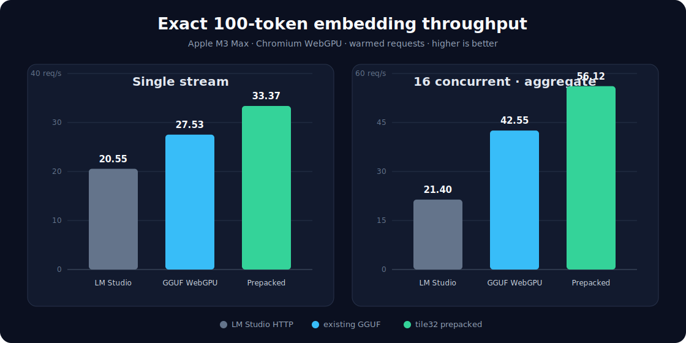

# Qwen3 Embedding 0.6B: prepacked WebGPU experiment

An experimental fork of [`qwen3-embedding-webgpu`](https://github.com/shihanqu/qwen3-embedding-webgpu) that moves Q4_0 repacking out of browser startup and into an offline, GPU-native model artifact. It uses custom WGSL for both low-latency inference and batches of up to 16 requests.

The original repository is unchanged. This fork is intentionally separate so the custom format can evolve without breaking the normal GGUF implementation.



## Results

Exact same-text 100-token requests, including EOS, were measured after model upload and pipeline warmup:

| Runtime | Single stream | 16-request aggregate | Batch/single |
|---|---:|---:|---:|
| LM Studio local endpoint | 20.55 req/s | 21.40 req/s | 1.04× |
| Existing WebGPU GGUF path | 27.53 req/s | 42.55 req/s | 1.55× |
| **Prepacked WebGPU** | **33.37 req/s** | **56.12 req/s** | **1.68×** |

The prepacked path is 62.4% faster than LM Studio for single-stream requests and 162.2% faster at concurrency 16. Relative to the existing WebGPU GGUF path, it is 21.2% faster single-stream and 31.9% faster at concurrency 16.

Correctness was checked against the same Q4_0 GGUF path: cosine similarity is `0.999936`. The batch and single prepacked paths agree at cosine `1.000000`.

### Test hardware

| Component | Configuration |
|---|---|
| Computer | MacBook Pro `Mac15,10` |
| SoC / GPU | Apple M3 Max, 30-core GPU |
| CPU | 14 cores (10 performance, 4 efficiency) |
| Memory | 96 GB unified memory |
| OS | macOS 26.5.2, build 25F84 |
| Browser | Chromium WebGPU with `shader-f16`, subgroups, and timestamp queries |
| LM Studio API | `text-embedding-qwen3-embedding-0.6b` at `127.0.0.1:1234` |

Numbers are hardware-, browser-, power-, and thermal-state-dependent. Run the included benchmark on the target system rather than treating these figures as universal.

## Required model files

The app needs both artifacts and loads their pinned GitHub Releases by default:

| Artifact | Purpose | Size | SHA-256 / source |
|---|---|---:|---|
| [`qwen3-embedding-0.6b-q4_0-webgpu.gguf`](https://github.com/shihanqu/qwen3-embedding-webgpu/releases/download/model-q4_0-v1/qwen3-embedding-0.6b-q4_0-webgpu.gguf) | GGUF metadata, token embeddings, norm weights, and source identity | 364 MiB | `4acbfc4947344ca4d4a215ee35e601c5e6f505172b517da194460e2ff113433e` |
| [`qwen3-embedding-0.6b-q4_0-webgpu-tile32.wgpack`](https://github.com/shihanqu/qwen3-embedding-webgpu-prepacked/releases/download/prepacked-v1/qwen3-embedding-0.6b-q4_0-webgpu-tile32.wgpack) | 140 prepacked Q4_0 projection matrices | 420 MiB | [`52c4b6…d24b3`](docs/prepacked-v1.sha256); header pins the GGUF SHA-256 above |

The `.wgpack` file is a derived representation, not a second independent model. The loader verifies its format and exposes the source GGUF hash in the parsed header. Model licensing remains Apache-2.0; source code is MIT.

## Quick start

Requirements:

- Node.js 24 or newer and npm.
- A Chromium browser exposing WebGPU, `shader-f16`, and subgroup operations.
- Roughly 1 GB of available GPU/shared memory for weights and working buffers.

```sh
git clone https://github.com/shihanqu/qwen3-embedding-webgpu-prepacked.git
cd qwen3-embedding-webgpu-prepacked
npm ci
npm run dev
```

Open `http://127.0.0.1:5173/?hundred=1`, click **Load model & benchmark kernel**, and look for `BENCHMARK_JSON` in the page output. Vite proxies both release assets through the local origin, avoiding cross-origin model-loading problems.

For local or offline copies:

```sh
npm run model:download:webgpu
curl -L \
  -o models/qwen3-embedding-0.6b-q4_0-webgpu-tile32.wgpack \
  https://github.com/shihanqu/qwen3-embedding-webgpu-prepacked/releases/download/prepacked-v1/qwen3-embedding-0.6b-q4_0-webgpu-tile32.wgpack

VITE_Q40_MODEL_URL=/models/qwen3-embedding-0.6b-q4_0-webgpu.gguf \
VITE_PREPACKED_MODEL_URL=/models/qwen3-embedding-0.6b-q4_0-webgpu-tile32.wgpack \
  npm run dev
```

Add `&gguf=1` to any benchmark URL to disable the custom artifact and run the existing GGUF path.

## Generate the prepacked artifact

First place the exact Q4_0 source model in `models/`, then run:

```sh
npm ci
npm run model:prepack -- \
  models/qwen3-embedding-0.6b-q4_0-webgpu.gguf \
  models/qwen3-embedding-0.6b-q4_0-webgpu-tile32.wgpack
```

The generator is deterministic. It reads GGUF tensor metadata, fuses Q+K and gate+up matrices, writes all Q4 projections in GPU tile order, records the source SHA-256, and aligns every tensor to 256 bytes.

The format is deliberately simple:

- 8-byte `WGPACK01` magic, a JSON header, then 256-byte-aligned tensor payloads.
- Output rows are grouped in 32-row tiles; K is grouped in 32-value Q4 blocks.
- Each aligned `u32` contains four already-reordered Q4 nibbles in its low 16 bits and their FP16 block scale in its high 16 bits.
- The browser uploads the payload directly. It does not concatenate Q/K or gate/up tensors and does not repack Q4 nibbles on the CPU.

This representation is larger than the source Q4 matrices because the scale is repeated for vector-native one-load decoding. Experiments with more compact and f16-expanded layouts were slower on the test GPU.

## Reproduce benchmarks

Browser modes:

- `?hundred=1` — ten warmed single requests and five warmed 16-request batches at exactly 100 tokens.
- `?hundred=1&gguf=1` — same benchmark through the existing GGUF path.
- `?hundred=1&vector=1` — additionally prints the 1,024-value reference vector for cosine comparison.
- `?hundred=1&profile=1` or `profile=16` — per-stage GPU timestamp profile.
- `?hundred=1&batchsweep=1` — adds batch sizes 2, 4, and 8.

Run the identical LM Studio HTTP benchmark with 16 independent workers:

```sh
npm run bench:baseline -- \
  --workload=hundred --input-index=0 \
  --concurrency=1,16 --duration-ms=5000 --warmup=2
```

The exact workload lives in `scripts/workloads.ts`. Do not compare different text, tokenizer lengths, array-valued endpoint batching, or cold model-load time.

The three final browser trials and comparison inputs are recorded in [`docs/benchmarks/2026-07-15-prepacked-m3-max.json`](docs/benchmarks/2026-07-15-prepacked-m3-max.json).

## Portability

The implementation targets WebGPU rather than Apple-, NVIDIA-, or AMD-specific shader code. The format contains no machine ISA and the kernels are WGSL, so the design is GPU-vendor agnostic in that sense. It is not accurate to promise identical behavior or speed on every GPU: the current kernels require `shader-f16` and subgroups, browser support varies, subgroup size and memory behavior differ, and this release was tested only on Apple M3 Max. NVIDIA and AMD systems meeting those WebGPU feature requirements are expected to work, but should be validated with `npm run check`, the exact-token benchmark, and cosine comparison.

## Development

```sh
npm run check
```

Key files:

- `src/prepacked/format.ts` — format writer/parser and source-hash metadata.
- `scripts/prepack-model.ts` — deterministic GGUF-to-`.wgpack` generator.
- `src/webgpu/quant-matmul.ts` — dense 64-wide single path and subgroup 16-request path.
- `src/webgpu/model.ts` — direct prepacked uploads and execution plans.
- `src/webgpu/ops.ts` — subgroup reductions and online causal attention.
- `tests/prepacked-format.test.ts` — byte-layout and parser test.

## License

Source code is [MIT licensed](LICENSE). Qwen model artifacts retain their upstream [Apache-2.0 terms](MODEL_LICENSE); see [MODEL_NOTICE.md](MODEL_NOTICE.md).
